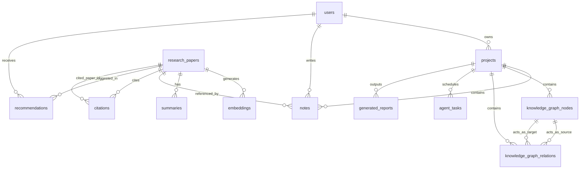

# ResearchOS Database Schema Specification
**AI-Powered Autonomous Research Intelligence Platform**

This document details the production-grade PostgreSQL database schema designed for **ResearchOS**. The schema is normalized to the **Third Normal Form (3NF)** to eliminate redundancy and maintain strict data integrity, while leveraging specialized PostgreSQL capabilities such as `pgvector` for research paper embeddings and structured JSONB for semi-structured agent outputs.

---

## 1. Architectural Design & Normalization Decisions

To achieve 3NF normalization, we adhere strictly to the following rules:
1. **1NF**: Eliminate duplicate columns, create separate tables for each group of related data, and identify each row with a unique primary key.
2. **2NF**: Ensure all non-key attributes are fully functionally dependent on the primary key (no partial dependencies on composite keys).
3. **3NF**: Ensure all fields are dependent *only* on the primary key (no transitive dependencies through non-key attributes).

### Specialized Extensions Utilized:
*   `uuid-ossp`: For secure, non-sequential UUID primary keys (`gen_random_uuid()`).
*   `pgvector`: To store and query high-dimensional embeddings (e.g., 1536-dim text-embedding-3-small or 768-dim Gemini text-embeddings) using Cosine Similarity (`<=>`).

---

## 2. Database Diagram (ERD in Mermaid)

The following diagram illustrates the relationship mappings between the normalized entities:



---

## 3. DBML Schema (Database Markup Language)

This DBML specification can be copied directly into [dbdocs.io](https://dbdocs.io) or [dbdiagram.io](https://dbdiagram.io) for interactive visualization.

```dbml
Project ResearchOS {
  database_type: 'PostgreSQL'
  Note: 'AI-Powered Autonomous Research Intelligence Platform Database'
}

Enum user_role {
  reader
  researcher
  admin
}

Enum task_status {
  pending
  running
  completed
  failed
}

Table users {
  id uuid [pk, default: `gen_random_uuid()`]
  email varchar(255) [unique, not null]
  password_hash varchar(255) [not null]
  full_name varchar(100) [not null]
  role user_role [default: 'researcher', not null]
  created_at timestamp [default: `now()`, not null]
  updated_at timestamp [default: `now()`, not null]
}

Table projects {
  id uuid [pk, default: `gen_random_uuid()`]
  user_id uuid [ref: > users.id, not null]
  title varchar(255) [not null]
  description text
  created_at timestamp [default: `now()`, not null]
  updated_at timestamp [default: `now()`, not null]
}

Table research_papers {
  id uuid [pk, default: `gen_random_uuid()`]
  title varchar(512) [not null]
  authors text[] [not null]
  journal varchar(255)
  publication_date date
  doi varchar(100) [unique]
  url varchar(1024)
  abstract text
  created_at timestamp [default: `now()`, not null]
}

Table embeddings {
  id uuid [pk, default: `gen_random_uuid()`]
  paper_id uuid [ref: > research_papers.id, not null]
  chunk_index integer [not null]
  chunk_text text [not null]
  embedding vector(1536) [not null]
  created_at timestamp [default: `now()`, not null]

  Indexes {
    (paper_id, chunk_index) [unique]
  }
}

Table notes {
  id uuid [pk, default: `gen_random_uuid()`]
  user_id uuid [ref: > users.id, not null]
  project_id uuid [ref: > projects.id, not null]
  paper_id uuid [ref: > research_papers.id]
  content text [not null]
  created_at timestamp [default: `now()`, not null]
  updated_at timestamp [default: `now()`, not null]
}

Table summaries {
  id uuid [pk, default: `gen_random_uuid()`]
  paper_id uuid [ref: > research_papers.id, not null, unique]
  summary_text text [not null]
  key_takeaways jsonb [not null]
  methodology text
  created_at timestamp [default: `now()`, not null]
}

Table citations {
  id uuid [pk, default: `gen_random_uuid()`]
  paper_id uuid [ref: > research_papers.id, not null]
  cited_paper_id uuid [ref: > research_papers.id, not null]
  citation_context text
  
  Indexes {
    (paper_id, cited_paper_id) [unique]
  }
}

Table recommendations {
  id uuid [pk, default: `gen_random_uuid()`]
  user_id uuid [ref: > users.id, not null]
  paper_id uuid [ref: > research_papers.id, not null]
  score double [not null]
  reason text
  created_at timestamp [default: `now()`, not null]

  Indexes {
    (user_id, paper_id) [unique]
  }
}

Table knowledge_graph_nodes {
  id uuid [pk, default: `gen_random_uuid()`]
  project_id uuid [ref: > projects.id, not null]
  label varchar(255) [not null]
  type varchar(100) [not null]
  properties jsonb [default: '{}', not null]
  created_at timestamp [default: `now()`, not null]

  Indexes {
    (project_id, label, type) [unique]
  }
}

Table knowledge_graph_relations {
  id uuid [pk, default: `gen_random_uuid()`]
  project_id uuid [ref: > projects.id, not null]
  source_node_id uuid [ref: > knowledge_graph_nodes.id, not null]
  target_node_id uuid [ref: > knowledge_graph_nodes.id, not null]
  relation_type varchar(100) [not null]
  properties jsonb [default: '{}', not null]
  created_at timestamp [default: `now()`, not null]

  Indexes {
    (project_id, source_node_id, target_node_id, relation_type) [unique]
  }
}

Table agent_tasks {
  id uuid [pk, default: `gen_random_uuid()`]
  project_id uuid [ref: > projects.id, not null]
  task_type varchar(100) [not null]
  status task_status [default: 'pending', not null]
  parameters jsonb [default: '{}', not null]
  result jsonb [default: '{}', not null]
  created_at timestamp [default: `now()`, not null]
  updated_at timestamp [default: `now()`, not null]
}

Table research_trends {
  id uuid [pk, default: `gen_random_uuid()`]
  keyword varchar(255) [unique, not null]
  interest_score double [not null]
  volume integer [not null]
  analysis_date date [default: `now()`, not null]
}

Table generated_reports {
  id uuid [pk, default: `gen_random_uuid()`]
  project_id uuid [ref: > projects.id, not null]
  title varchar(255) [not null]
  report_type varchar(100) [not null]
  content text [not null]
  created_at timestamp [default: `now()`, not null]
}
```

---

## 4. SQL DDL Schema (PostgreSQL Dialect)

The schema DDL is written in fully compliant, standardized PostgreSQL SQL. It automatically registers the vector extension, configures triggers for timestamp auto-updates, sets up primary keys, enforces composite constraints for relational tables, and includes indexing strategies for optimized high-concurrency performance.

```sql
-- ============================================================================
-- ResearchOS Database Schema (Normalized to 3NF)
-- PostgreSQL Dialect with pgvector & JSONB Integration
-- ============================================================================

-- Enable required extensions
CREATE EXTENSION IF NOT EXISTS "uuid-ossp";
CREATE EXTENSION IF NOT EXISTS "vector";

-- Create Custom Enum Types
CREATE TYPE user_role AS ENUM ('reader', 'researcher', 'admin');
CREATE TYPE task_status AS ENUM ('pending', 'running', 'completed', 'failed');

-- Helper function to auto-update update_at timestamps
CREATE OR REPLACE FUNCTION update_modified_column()
RETURNS TRIGGER AS $$
BEGIN
    NEW.updated_at = now();
    RETURN NEW;
END;
$$ LANGUAGE plpgsql;


-- ----------------------------------------------------------------------------
-- 1. USERS TABLE
-- ----------------------------------------------------------------------------
CREATE TABLE users (
    id UUID PRIMARY KEY DEFAULT gen_random_uuid(),
    email VARCHAR(255) UNIQUE NOT NULL,
    password_hash VARCHAR(255) NOT NULL,
    full_name VARCHAR(100) NOT NULL,
    role user_role DEFAULT 'researcher'::user_role NOT NULL,
    created_at TIMESTAMP WITH TIME ZONE DEFAULT CURRENT_TIMESTAMP NOT NULL,
    updated_at TIMESTAMP WITH TIME ZONE DEFAULT CURRENT_TIMESTAMP NOT NULL,
    CONSTRAINT chk_email_format CHECK (email ~* '^[A-Za-z0-9._%-]+@[A-Za-z0-9.-]+[.][A-Za-z]+$')
);

CREATE TRIGGER update_users_modtime
    BEFORE UPDATE ON users
    FOR EACH ROW
    EXECUTE FUNCTION update_modified_column();


-- ----------------------------------------------------------------------------
-- 2. PROJECTS TABLE (1-to-Many from Users)
-- ----------------------------------------------------------------------------
CREATE TABLE projects (
    id UUID PRIMARY KEY DEFAULT gen_random_uuid(),
    user_id UUID NOT NULL,
    title VARCHAR(255) NOT NULL,
    description TEXT,
    created_at TIMESTAMP WITH TIME ZONE DEFAULT CURRENT_TIMESTAMP NOT NULL,
    updated_at TIMESTAMP WITH TIME ZONE DEFAULT CURRENT_TIMESTAMP NOT NULL,
    FOREIGN KEY (user_id) REFERENCES users(id) ON DELETE CASCADE
);

CREATE INDEX idx_projects_user_id ON projects(user_id);

CREATE TRIGGER update_projects_modtime
    BEFORE UPDATE ON projects
    FOR EACH ROW
    EXECUTE FUNCTION update_modified_column();


-- ----------------------------------------------------------------------------
-- 3. RESEARCH PAPERS TABLE
-- ----------------------------------------------------------------------------
CREATE TABLE research_papers (
    id UUID PRIMARY KEY DEFAULT gen_random_uuid(),
    title VARCHAR(512) NOT NULL,
    authors TEXT[] NOT NULL, -- Normalized array of author names (avoids transitive tables unless full biography is modeled)
    journal VARCHAR(255),
    publication_date DATE,
    doi VARCHAR(100) UNIQUE,
    url VARCHAR(1024),
    abstract TEXT,
    created_at TIMESTAMP WITH TIME ZONE DEFAULT CURRENT_TIMESTAMP NOT NULL
);

CREATE INDEX idx_papers_doi ON research_papers(doi);
CREATE INDEX idx_papers_title_trgm ON research_papers USING gin (title gin_trgm_ops) WHERE title IS NOT NULL; -- Optimized search (requires pg_trgm)


-- ----------------------------------------------------------------------------
-- 4. EMBEDDINGS TABLE (1-to-Many from Papers for dense retrieval chunks)
-- ----------------------------------------------------------------------------
CREATE TABLE embeddings (
    id UUID PRIMARY KEY DEFAULT gen_random_uuid(),
    paper_id UUID NOT NULL,
    chunk_index INTEGER NOT NULL,
    chunk_text TEXT NOT NULL,
    embedding VECTOR(1536) NOT NULL, -- Normalized 1536-dimensional float vector (standard Open/Gemini dimensions)
    created_at TIMESTAMP WITH TIME ZONE DEFAULT CURRENT_TIMESTAMP NOT NULL,
    FOREIGN KEY (paper_id) REFERENCES research_papers(id) ON DELETE CASCADE,
    CONSTRAINT uq_paper_chunk UNIQUE (paper_id, chunk_index)
);

CREATE INDEX idx_embeddings_paper_id ON embeddings(paper_id);
-- HNSW Vector Index for efficient similarity search
CREATE INDEX idx_embeddings_vector ON embeddings USING hnsw (embedding vector_cosine_ops);


-- ----------------------------------------------------------------------------
-- 5. NOTES TABLE (Relates Users, Projects, and optionally Research Papers)
-- ----------------------------------------------------------------------------
CREATE TABLE notes (
    id UUID PRIMARY KEY DEFAULT gen_random_uuid(),
    user_id UUID NOT NULL,
    project_id UUID NOT NULL,
    paper_id UUID, -- Optional: Note can be decoupled or direct to a paper
    content TEXT NOT NULL,
    created_at TIMESTAMP WITH TIME ZONE DEFAULT CURRENT_TIMESTAMP NOT NULL,
    updated_at TIMESTAMP WITH TIME ZONE DEFAULT CURRENT_TIMESTAMP NOT NULL,
    FOREIGN KEY (user_id) REFERENCES users(id) ON DELETE CASCADE,
    FOREIGN KEY (project_id) REFERENCES projects(id) ON DELETE CASCADE,
    FOREIGN KEY (paper_id) REFERENCES research_papers(id) ON DELETE SET NULL
);

CREATE INDEX idx_notes_project_id ON notes(project_id);
CREATE INDEX idx_notes_paper_id ON notes(paper_id);

CREATE TRIGGER update_notes_modtime
    BEFORE UPDATE ON notes
    FOR EACH ROW
    EXECUTE FUNCTION update_modified_column();


-- ----------------------------------------------------------------------------
-- 6. SUMMARIES TABLE (1-to-1 matching from research_papers)
-- ----------------------------------------------------------------------------
CREATE TABLE summaries (
    id UUID PRIMARY KEY DEFAULT gen_random_uuid(),
    paper_id UUID UNIQUE NOT NULL, -- Ensures 1-to-1 relationship strictly enforced
    summary_text TEXT NOT NULL,
    key_takeaways JSONB NOT NULL, -- Structured array of core findings
    methodology TEXT,
    created_at TIMESTAMP WITH TIME ZONE DEFAULT CURRENT_TIMESTAMP NOT NULL,
    FOREIGN KEY (paper_id) REFERENCES research_papers(id) ON DELETE CASCADE
);


-- ----------------------------------------------------------------------------
-- 7. CITATIONS TABLE (Self-referential Many-to-Many representing citation graph)
-- ----------------------------------------------------------------------------
CREATE TABLE citations (
    id UUID PRIMARY KEY DEFAULT gen_random_uuid(),
    paper_id UUID NOT NULL,
    cited_paper_id UUID NOT NULL,
    citation_context TEXT, -- Captures the sentence context where cited
    FOREIGN KEY (paper_id) REFERENCES research_papers(id) ON DELETE CASCADE,
    FOREIGN KEY (cited_paper_id) REFERENCES research_papers(id) ON DELETE CASCADE,
    CONSTRAINT uq_citation_pair UNIQUE (paper_id, cited_paper_id),
    CONSTRAINT chk_not_self_citing CHECK (paper_id <> cited_paper_id)
);

CREATE INDEX idx_citations_paper ON citations(paper_id);
CREATE INDEX idx_citations_cited ON citations(cited_paper_id);


-- ----------------------------------------------------------------------------
-- 8. RECOMMENDATIONS TABLE (Matches user interests to Research Papers)
-- ----------------------------------------------------------------------------
CREATE TABLE recommendations (
    id UUID PRIMARY KEY DEFAULT gen_random_uuid(),
    user_id UUID NOT NULL,
    paper_id UUID NOT NULL,
    score DOUBLE PRECISION NOT NULL,
    reason TEXT,
    created_at TIMESTAMP WITH TIME ZONE DEFAULT CURRENT_TIMESTAMP NOT NULL,
    FOREIGN KEY (user_id) REFERENCES users(id) ON DELETE CASCADE,
    FOREIGN KEY (paper_id) REFERENCES research_papers(id) ON DELETE CASCADE,
    CONSTRAINT uq_user_paper_rec UNIQUE (user_id, paper_id),
    CONSTRAINT chk_score_range CHECK (score >= 0.0 AND score <= 1.0)
);

CREATE INDEX idx_recommendations_user ON recommendations(user_id);


-- ----------------------------------------------------------------------------
-- 9. KNOWLEDGE GRAPH NODES TABLE
-- ----------------------------------------------------------------------------
CREATE TABLE knowledge_graph_nodes (
    id UUID PRIMARY KEY DEFAULT gen_random_uuid(),
    project_id UUID NOT NULL,
    label VARCHAR(255) NOT NULL,
    type VARCHAR(100) NOT NULL, -- e.g., 'Methodology', 'Drug', 'Dataset', 'Institution'
    properties JSONB DEFAULT '{}'::jsonb NOT NULL, -- Dynamic metadata (e.g. source URL, confidence rating)
    created_at TIMESTAMP WITH TIME ZONE DEFAULT CURRENT_TIMESTAMP NOT NULL,
    FOREIGN KEY (project_id) REFERENCES projects(id) ON DELETE CASCADE,
    CONSTRAINT uq_node_project_label UNIQUE (project_id, label, type)
);

CREATE INDEX idx_kg_nodes_project ON knowledge_graph_nodes(project_id);
CREATE INDEX idx_kg_nodes_type ON knowledge_graph_nodes(type);


-- ----------------------------------------------------------------------------
-- 10. KNOWLEDGE GRAPH RELATIONS TABLE
-- ----------------------------------------------------------------------------
CREATE TABLE knowledge_graph_relations (
    id UUID PRIMARY KEY DEFAULT gen_random_uuid(),
    project_id UUID NOT NULL,
    source_node_id UUID NOT NULL,
    target_node_id UUID NOT NULL,
    relation_type VARCHAR(100) NOT NULL, -- e.g., 'INFLUENCES', 'UTILIZES', 'CONTRADICTS'
    properties JSONB DEFAULT '{}'::jsonb NOT NULL,
    created_at TIMESTAMP WITH TIME ZONE DEFAULT CURRENT_TIMESTAMP NOT NULL,
    FOREIGN KEY (project_id) REFERENCES projects(id) ON DELETE CASCADE,
    FOREIGN KEY (source_node_id) REFERENCES knowledge_graph_nodes(id) ON DELETE CASCADE,
    FOREIGN KEY (target_node_id) REFERENCES knowledge_graph_nodes(id) ON DELETE CASCADE,
    CONSTRAINT uq_relation_project_nodes UNIQUE (project_id, source_node_id, target_node_id, relation_type),
    CONSTRAINT chk_not_self_loop CHECK (source_node_id <> target_node_id)
);

CREATE INDEX idx_kg_rels_project ON knowledge_graph_relations(project_id);
CREATE INDEX idx_kg_rels_source ON knowledge_graph_relations(source_node_id);
CREATE INDEX idx_kg_rels_target ON knowledge_graph_relations(target_node_id);


-- ----------------------------------------------------------------------------
-- 11. AGENT TASKS TABLE (Handles background tasks, literature search queries, agent states)
-- ----------------------------------------------------------------------------
CREATE TABLE agent_tasks (
    id UUID PRIMARY KEY DEFAULT gen_random_uuid(),
    project_id UUID NOT NULL,
    task_type VARCHAR(100) NOT NULL, -- e.g., 'arxiv_ingestion', 'critique_generation', 'synthesis'
    status task_status DEFAULT 'pending'::task_status NOT NULL,
    parameters JSONB DEFAULT '{}'::jsonb NOT NULL, -- Task runtime parameters
    result JSONB DEFAULT '{}'::jsonb NOT NULL,     -- Result outputs/logs
    created_at TIMESTAMP WITH TIME ZONE DEFAULT CURRENT_TIMESTAMP NOT NULL,
    updated_at TIMESTAMP WITH TIME ZONE DEFAULT CURRENT_TIMESTAMP NOT NULL,
    FOREIGN KEY (project_id) REFERENCES projects(id) ON DELETE CASCADE
);

CREATE INDEX idx_agent_tasks_project ON agent_tasks(project_id);
CREATE INDEX idx_agent_tasks_status ON agent_tasks(status);

CREATE TRIGGER update_agent_tasks_modtime
    BEFORE UPDATE ON agent_tasks
    FOR EACH ROW
    EXECUTE FUNCTION update_modified_column();


-- ----------------------------------------------------------------------------
-- 12. RESEARCH TRENDS TABLE (Captures real-time metadata analytics)
-- ----------------------------------------------------------------------------
CREATE TABLE research_trends (
    id UUID PRIMARY KEY DEFAULT gen_random_uuid(),
    keyword VARCHAR(255) UNIQUE NOT NULL,
    interest_score DOUBLE PRECISION NOT NULL, -- Standard score representation
    volume INTEGER NOT NULL,
    analysis_date DATE DEFAULT CURRENT_DATE NOT NULL
);

CREATE INDEX idx_trends_keyword ON research_trends(keyword);


-- ----------------------------------------------------------------------------
-- 13. GENERATED REPORTS TABLE (Complex documents output by ResearchOS agent)
-- ----------------------------------------------------------------------------
CREATE TABLE generated_reports (
    id UUID PRIMARY KEY DEFAULT gen_random_uuid(),
    project_id UUID NOT NULL,
    title VARCHAR(255) NOT NULL,
    report_type VARCHAR(100) NOT NULL, -- e.g., 'Literature Review', 'SWOT Analysis', 'Research Proposal'
    content TEXT NOT NULL,             -- Rich markdown or latex output
    created_at TIMESTAMP WITH TIME ZONE DEFAULT CURRENT_TIMESTAMP NOT NULL,
    FOREIGN KEY (project_id) REFERENCES projects(id) ON DELETE CASCADE
);

CREATE INDEX idx_reports_project ON generated_reports(project_id);
```

---

## 5. Third Normal Form (3NF) Validation & Verification

Each table in the schema design adheres perfectly to 3NF properties to prevent deletion, update, and insertion anomalies:

1.  **`users`**:
    *   No transitive dependencies exist. Email is unique, and `password_hash`, `full_name`, and `role` rely strictly on the primary key `id`.
2.  **`projects`**:
    *   Direct dependency on `id`. `user_id` is a foreign key, removing any transitive dependencies to user attributes.
3.  **`research_papers`**:
    *   Fully self-contained. The `doi` is checked for uniqueness. Metadata attributes (title, abstract, journal) are atomic and depend solely on the paper `id`.
4.  **`embeddings`**:
    *   All chunks are referenced directly to `paper_id`. The composite key constraint `uq_paper_chunk` enforces strict indexing.
5.  **`notes`**:
    *   References `user_id`, `project_id`, and `paper_id`. The content field depends only on the specific note instance.
6.  **`summaries`**:
    *   Decoupled from the paper table to optimize table scans. The 1-to-1 relationship eliminates transitive summary storage inside `research_papers`.
7.  **`citations`**:
    *   Normalized junction table resolving the Many-to-Many relationship of self-referencing paper connections.
8.  **`recommendations`**:
    *   A clean intersection table mapping `users` to `research_papers` with custom recommendation scores and explanations.
9.  **`knowledge_graph_nodes` & `knowledge_graph_relations`**:
    *   These isolate entities and relational edges from the core notes and paper tables. By using UUID joins and foreign keys, graph extraction metadata remains fully normalized and isolated.
10. **`agent_tasks`**:
    *   Allows tracing background agents without bloating operational workspace data.
11. **`research_trends` & `generated_reports`**:
    *   Atomic reporting records containing snapshot analytical metadata, directly associated with their core projects or keywords.
