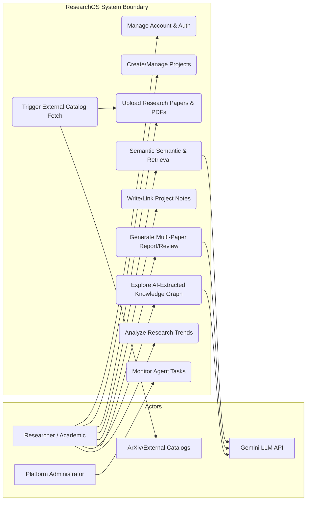
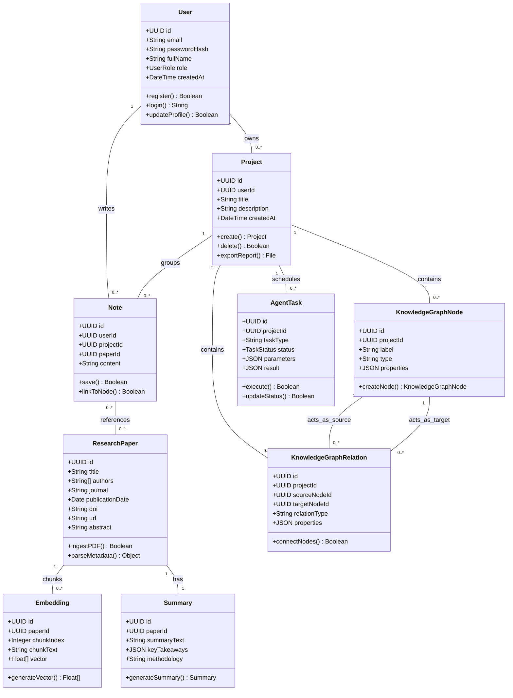
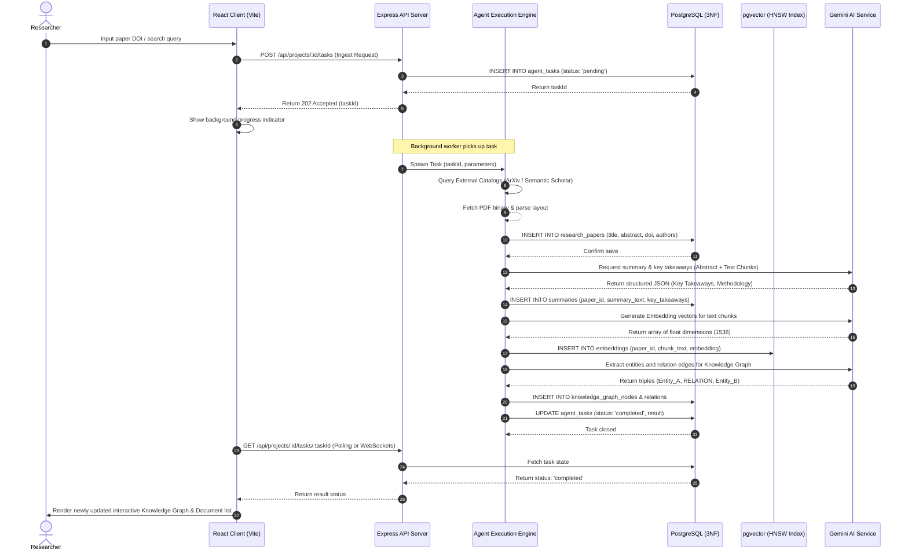
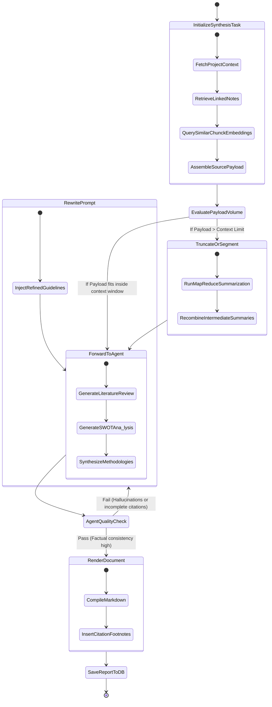
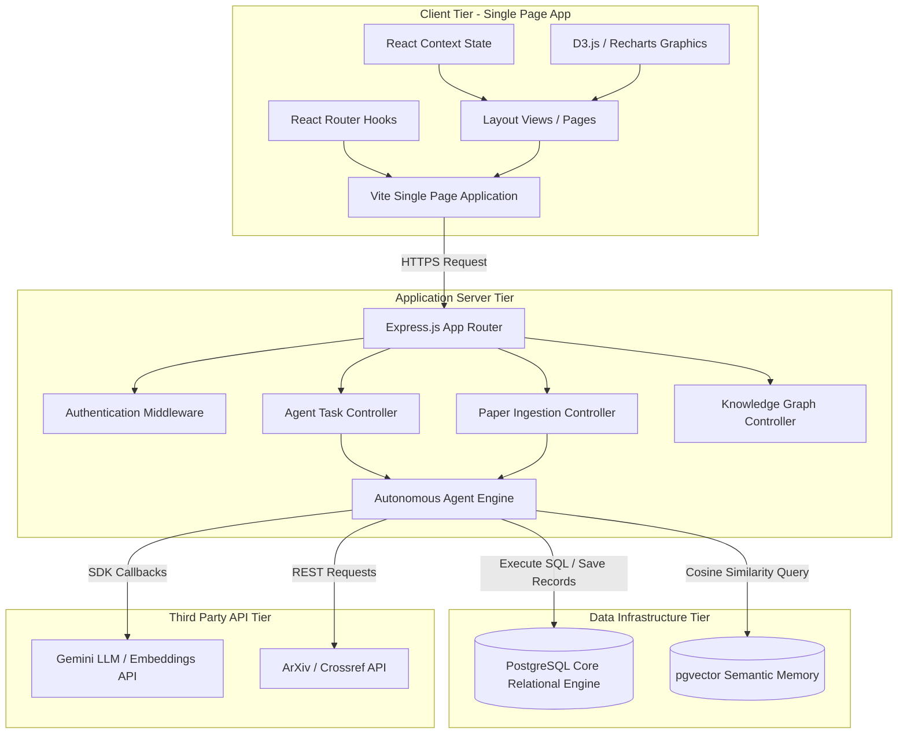
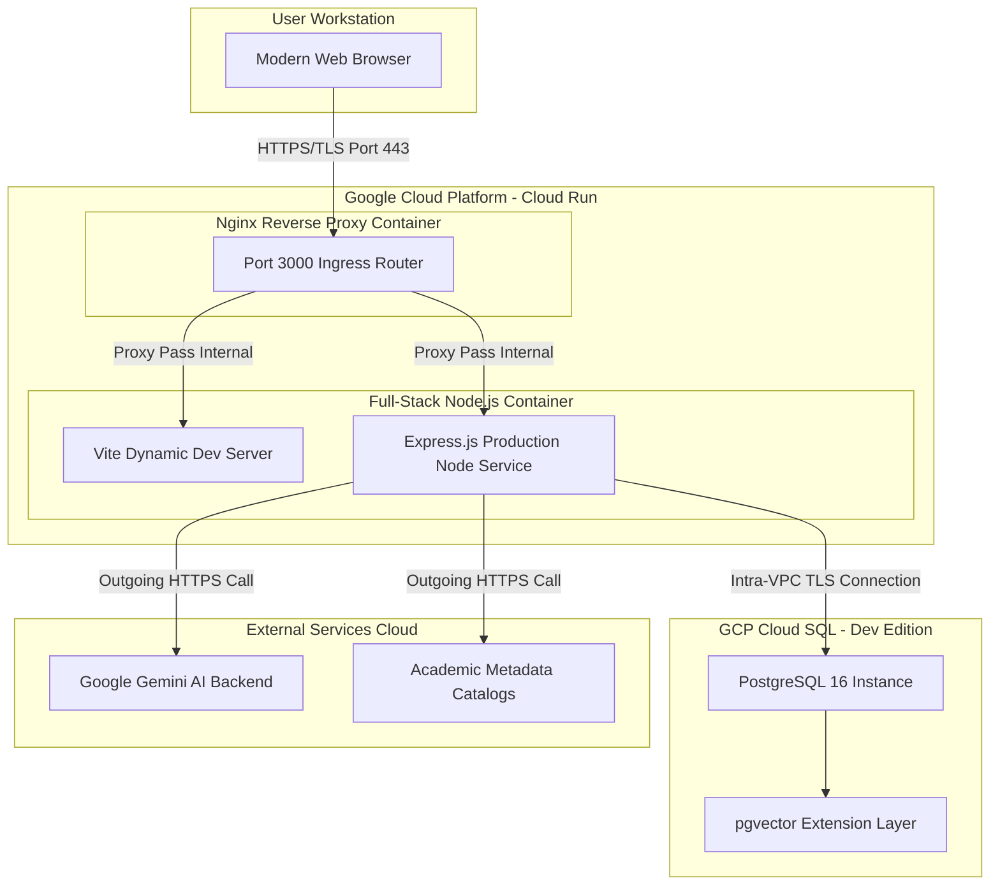

# ResearchOS UML Design Specification
**AI-Powered Autonomous Research Intelligence Platform**

This document contains complete system design diagrams for **ResearchOS** using the standardized Mermaid syntax. These architectural models capture user-system boundaries, static class relations, dynamic query/ingest sequences, processing activity states, component distribution boundaries, and operational deployment topologies.

---

## 1. Use Case Diagram

Because Mermaid does not have a native "usecase" diagram type, we model this elegantly using a hierarchically structured flowchart with boundary subgraphs. This clearly separates **Actors** (on the left/right boundaries) from the internal **System Boundary** containing operational Use Cases.

---

## 2. Class Diagram

This class diagram represents the static, object-oriented data structures inside ResearchOS. It models entity relationships, core properties, access modifiers, and operational methods.

---

## 3. Sequence Diagram

This sequence diagram depicts the end-to-end flow for **Autonomous Research Ingestion & Graph Extraction**. It illustrates the dynamic message exchanges between the user interface, backend server, background agents, external databases, vector stores, and the Gemini API.

---

## 4. Activity Diagram

This Activity Diagram models the dynamic operational workflows of ResearchOS's multi-agent report writer. It illustrates decision pathways, branching, and synchronous merges.

---

## 5. Component Diagram

The component diagram details the physical organization and dependencies of the system modules.

---

## 6. Deployment Diagram

This deployment model maps the software components onto target execution environments, mirroring the containerized Cloud Run system constraints.

